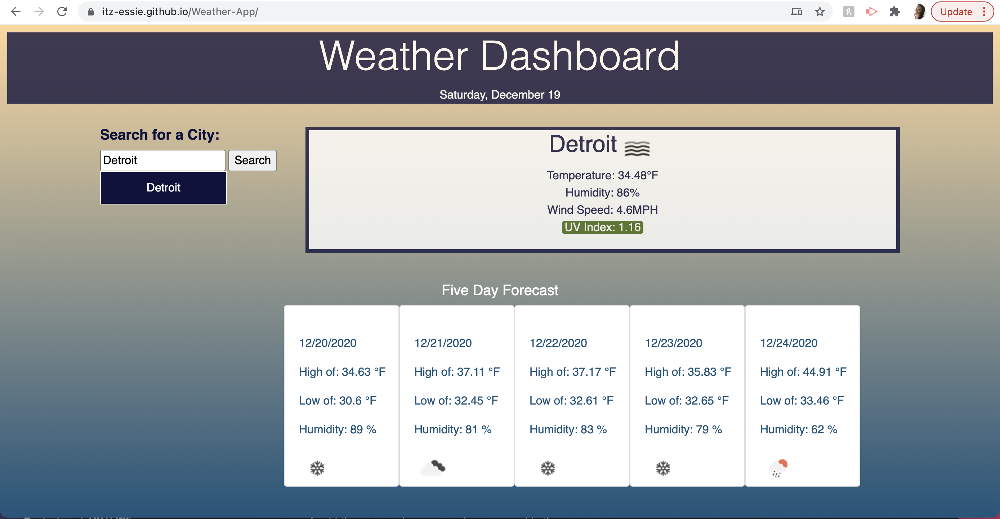

# Weather Dashboard 

##  Task

As a developer, I am being asked to build a weather dashboard that will run in the browser and feature dynamically updated HTML and CSS. Data will be retrieved from a third-party weather API (OpenWeather API).

## How To Use Application

When user searches a city, they will be present with current and future weather conditions for that city. The search city will be added to the search history. User will be able to view city name, an icon representing weather conditions, the temperature, humidty, wind speed, and UV index. 

When user viiews the UV index they will be presented with a color that indicates whether the index is low, moderate, high, very high, or extreme. When a user view the future conditions for the searched city, by viewing the 5-day forecast, they will be able to see the high and low temperatures, weather conditions, as well as humidity.

When user clicks on a city in the search history, they will again be presented with current and future conditions for that city. When user opens the weather dashboard, they will be presented with the last searched city forecast.

## Screenshot of application

## Technologies Used
- JavaScript
- OpenWeather API
- HTML
- CSS

## Review

* https://itz-essie.github.io/Weather-App/

* https://github.com/itz-essie/Weather-App

